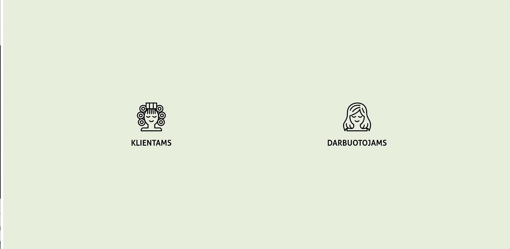

# NFQ užduotis "Kirpykla"

Kirpyklos internetinėje svetainėje klientai gali užsiregistruoti norimu laiku į kirpyklą.
Kirpyklos darbuotojai gali pasitikrinti savo bei kolegų užimtumą ir užregistruoti klientus patys.

## Internetinė svetainė

Internetinę svetainė pasiekiama adresu: [nfq.bikulciute.lt](http://nfq.bikulciute.lt)

## Skiltis klientams

Duomenys filtruojami pagal datą ir darbo laiką.

## Skiltis kirpėjams

Duomenys filtruojami įvairiais būdais - pagal kirpėjo vardą, kirpimo tipą, datą, laisvus ir užimtus laikus. Kirpėjoms patogu sužinoti užimtą laiką ir kokio tipo kirpimą atliks.

